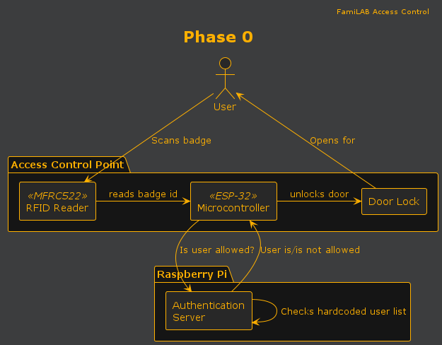
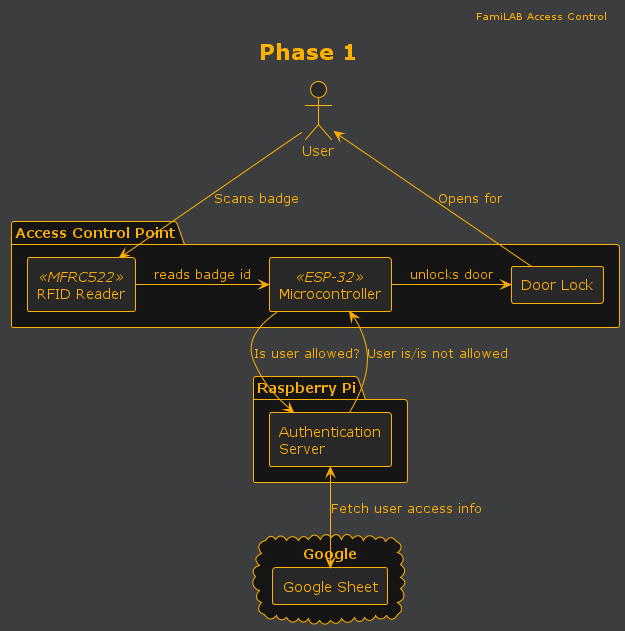

<style>
body {
  color: #fda501;
  background-color: #2b2b2b;
}
</style>

FamiLAB Access Controller
=========================

Access Control software written for FamiLAB.

## Components

### Access Control Point

- Badge scanner and door unlock trigger.
- Microcontroller written in CircuitPython.
- Reads badge, calls auth server, if ✅ then open door.

See [nfc/README.md](./nfc/README.md)

### Authentication Server

- HTTP server written in Typescript.
- Exposes `/access` endpoint.
- `/access` endpoint fetches badge list from Google Sheets for validation.

See [api/README.md](./api/README.md)

## Development Setup

1. Install Node 18+
2. Globally install `pnpm`
    ```bash
    npm install --global pnpm
    ```
3. Install Node packages
    ```bash
    pnpm install
    ```
4. Follow Development Setup instructions for the sub-project you wish to work on.

## Project Status

Currently implementing Phase 0.

### Phase 0

Phase 0 is the absolute minimum functionality that allows badge access to the new facility. It is not meant to be
long-term, it is not meant to be well-designed. Has the minimum number of infrastructure dependencies.

#### Requirements

- Working door lock
- ACP that can read badges and unlock door
- WiFi network without Internet

#### Functionality

1. User scans badge
2. ACP calls Auth Server with badge and location
3. Auth Server checks against hardcoded list and responds ✅/❌
4. If user has access, ACP triggers relay to unlock door

#### Hardware

- ACP: ESP-32 and MFRC522 connected on a breadboard, possibly powered by USB
- Auth Server: Living on a raspberry pi or something

#### Component Diagram



### Phase 1

This is the first _real_ version of the access control system.

#### Requirements

- 12/24v DC power line run to the door location
- Internet access

#### Functionality

1. User scans badge
2. ACP calls Auth Server with badge and location
3. Auth Server fetches Google Sheet contents (or checks cache) and responds ✅/❌
4. If user has access, ACP triggers relay to unlock door

#### Hardware

- ACP: MFRC522 mounted outside door, ESP32 mounted inside. Powered by hardwired DC.
- Auth Server: Can still be on temp hardware, but now has internet access.

#### Component Diagram



### Phase 2

Some enhancements that can be made in the future, fairly independently.

#### Permanent ACP hardware build

- Manufactured PCB
- External antenna for MFRC522
- Status LED/display

#### Central Relay Board

- Centralized relay board that powers all door locks
- ACP would then not be responsible for door lock, just communicating with auth server
- All power control in one place
- Allows for remote opening of doors, doors unlocked for open house, etc.

#### Better Auth Server hosting/networking security

- Permanent hosting infrastructure, more reliable server than Raspberry Pi
- Internal DNS hostname would allow for TLS, reduces sniffing/man-in-the-middle attacks
- Put all access control devices on separate subnet/vlan, improves network security
